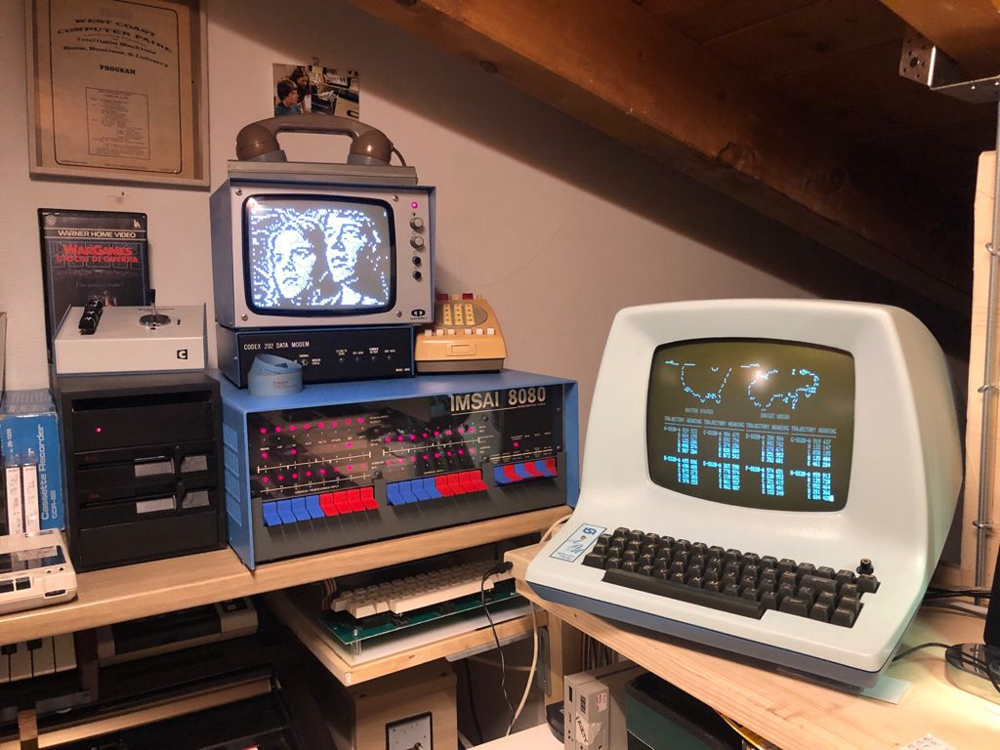
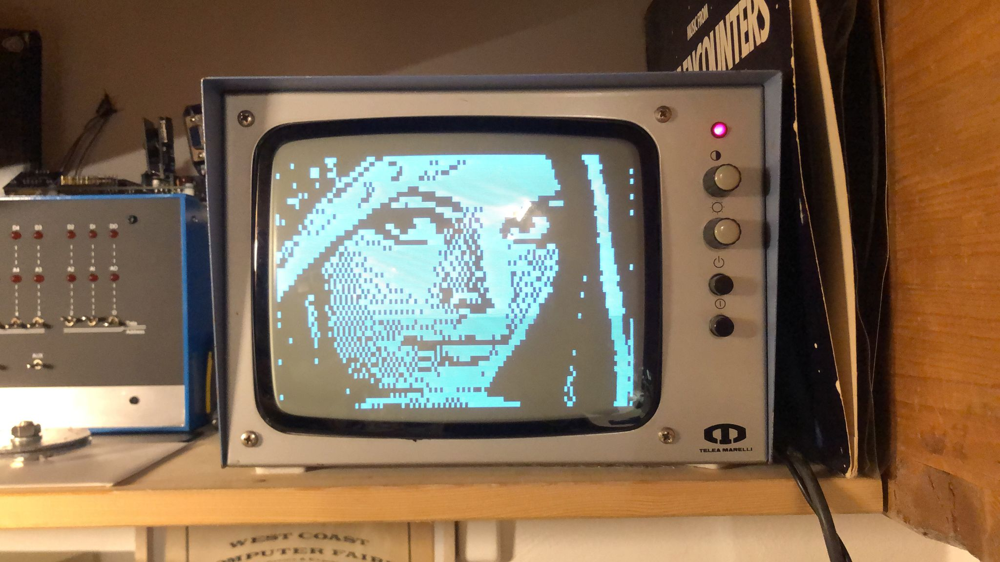

# VTI Lib

C library (for **Z88DK**) for VTI graphics board for S100 computers (IMSAI, Altair, Poly88,...). Made for CP/M projects.

## VTI (Video Terminal Interface)

VTI is a S100 "graphics" board, made for "Poly88" system, but it works also with other S100 machines like Altair 8800, IMSAI 8080, ...

Here is the board description: http://www.s100computers.com/Hardware%20Folder/PolyMorphic/Video%20Board/Video%20Board.htm

It uses a memory-mapped I/O so writing a single byte to memory would make a character appear on screen. It has a 64x16 chars resolution, and it has a set of "2x3" block characters, so it can reach a 128x48 "pixels" resolution.

Starting address is $F800 by default, but it can be changed using dip-switches. In the IMSAI 8080 in this video it has been changed to $E800 and has some glitches due to a broken RAM chip, which has to be replaced.

## Sample code

Here is sort of "hello world":

    #include "vti.h"
    
    void main(void) {
      vti_set_start(0xf800); // optional since 0xf800 is the default
      vti_clear_screen();
      
      vti_setmode(VTI_MODE_SET);    // "1" (or VTI_MODE_SET) means "draw"
      vti_line(0, 0, 120, 45);      // segment with coords (0,0)-(120,45).
      
      vti_setmode(VTI_MODE_SET);    // "1" (or VTI_MODE_SET) means "draw"
      vti_boxfill(2, 3, 25, 25);    // box filled with edges (2,3) and (25, 25).
      
      vti_setmode(VTI_MODE_RESET);  // "0" (or VTI_MODE_RESET) means "erase"
      vti_boxfill(3, 4, 25, 25);    // as above, but "0" means "erase"
      
      vti_setmode(VTI_MODE_INVERT); // "2" (or VTI_MODE_INVERT) means "XOR" for each pixel
      vti_boxfill(1, 1, 10, 10);    // box filled with edges (1,1)-(10,10). 
    }

## Function **vti_plot** and "mode" parameter

Main function of the library is `vti_plot` in conjunction with `vti_setmode` which have the following prototypes:

    void vti_setmode(char mode);
    void vti_plot(int x, int y);

...where **x** and **y** are cartesian coordinates with (0,0) as top-left origin and max values equal to (127,47).
The parameter **mode** represents the way the dot is drawn, and can have the following values:

* **0 = VTI_MODE_RESET**. It erases the dot at specified coordinates, making it *black*.
* **1 = VTI_MODE_SET**. It draws the dot, making it *white*.
* **2 = VTI_MODE_INVERT**. It draws the dot if it's currently off (=black), and erases it if it's currently on (=white)

## List of library's functions

* vti_set_start(*\<start address\>*)
* vti_setmode(*\<mode\>*)
* vti_print_at(*\<x\>*, *\<y\>*, *"string"*)
* vti_clear_screen()
* vti_fill_screen(*\<char\>*)
* vti_save_screen(*\<buffer address\>*)
* vti_restore_screen(*\<buffer address\>*)
* vti_rawchar_at(*\<x\>*, *\<y\>*, *\<char\>*)
* vti_plot(*\<x\>*, *\<y\>*)
* vti_line(*\<x0\>*, *\<y0\>*, *\<x1\>*, *\<y1\>*)
* vti_ellipse_rect(*\<x0\>*, *\<y0\>*, *\<x1\>*, *\<y1\>*)
* vti_box(*\<x0\>*, *\<y0\>*, *\<x1\>*, *\<y1\>*)
* vti_boxfill(*\<x0\>*, *\<y0\>*, *\<x1\>*, *\<y1\>*)
* vti_scroll_up(*\<number-of-rows\>*)
* vti_scroll_down(*\<number-of-rows\>*)
* vti_put_shape(*\<x\>*, *\<y\>*, char\*, *\<width\>*, *\<height\>*)
* *\<pixel\>* = vti_read_pixel(*\<x\>*, *\<y\>*)
* *\<ch\>* = vti_read_char(*\<x\>*, *\<y\>*)

## Compiling demos

There is a **build.bat** file which does all the work with **Z88DK**, this is a sample line:

```$ zcc +cpm -clib=8080 demo.c vti.c -o demo.com```

## Launching demos

By default, the start address is **$F800**. To use another address, pass it as argument in decimal notation:

```$ demo 59392```

This will make the demo use $E800 (59392) as start address for the graphics card.

There are the following demos (launch each of them eventually with the start address as parameter):

* **demo.com**: a bunch of sample of most function available in the library
* **ball.com**: a *bouncing ball* across the screen
* **pong.com**: the famous game, using a keyboard connected to the VTI's special slot
* **bezier.com**: drawing of the G-clef, using bezier curves
* **fonts.com**: draw text with big letters
* **lenna.com**: drawing of the famous test image https://en.wikipedia.org/wiki/Lenna
* **ttt.com**: tic-tac-toe, inspired by [**War Games**](https://en.wikipedia.org/wiki/WarGames)



## Running demo in a video

[](https://www.youtube.com/watch?v=v8e73I5sO7A)

## Credits
Thanks to:
- [**Alois Zingl**](http://members.chello.at/~easyfilter/bresenham.html) for implementation of Bresenham's Algorithms (lines and curves drawing)
- [**Andrea Matteucci**](https://www.facebook.com/andrewmattew81/) for hardware providing and fixing
- [**Antonino Porcino**](https://github.com/nippur72) for a lot of code optimizazions and demos **lenna**, **fonts**
- **Brian W. Howell** for Tic-Tac-Toe's AI logic
- [**Andy Glenn**](https://github.com/zompiexx/wargames/blob/main/wargames.bas) for "reverse engineering" of some WarGames screenshots
- [**Paul Smith**](https://gist.github.com/paulsmith/ca3635527bf36e3bf5a8cb1e622abfee) for list of WOPR nuclear war scenarios
- [**George Philips**](http://48k.ca/wgascii.html) for ASCII-art drawing of USA and USSR resembling WarGames' scene
